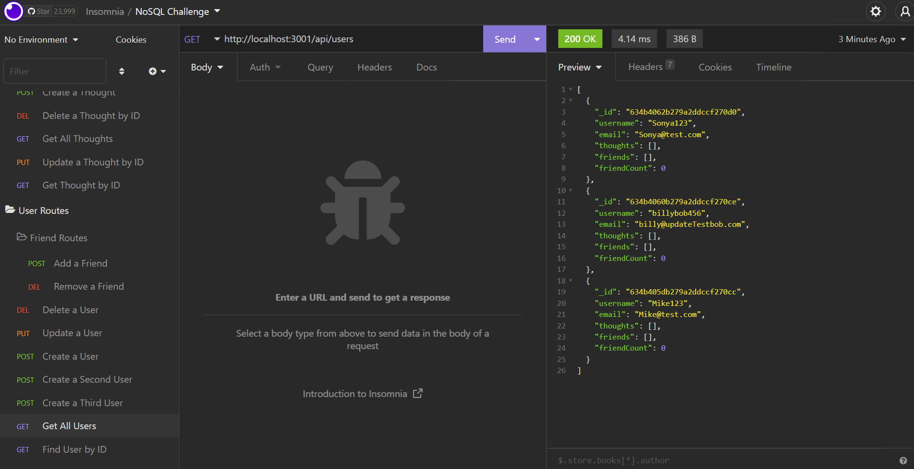
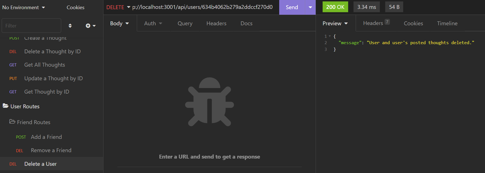
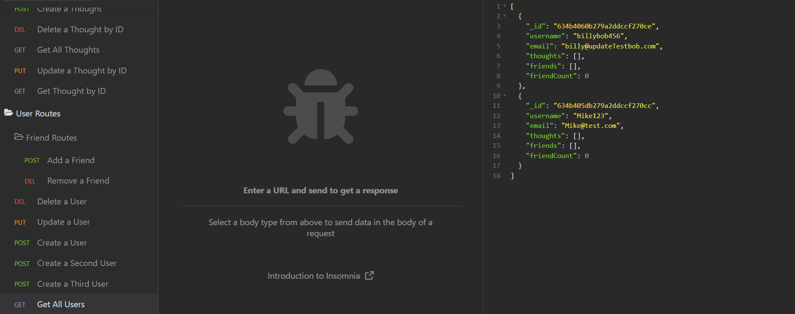

# NoSQL-social-network-api
## Table of Contents
1. [Description](#description)
2. [Technology](#technology)
3. [Installation](#installation)
4. [Visuals](#visuals)
5. [License](#license)

## Description
This application aims to demonstrate the functionality and usefulness of MongoDB as a NoSQL database. Used in conjunction with mongoose ODM, this project creates a social network platform that allows users to share thoughts, react to thoughts posted by friends, delete their posted thoughts, and create a friends list. 
The linked video above demonstrates the functionality of the application via a series of routing tests in Insomnia. 

## Technology
Application uses JavaScript, Express.js, Node.Js, MongoDB, and Mongooose ODM packages.

Insomnia used in video demonstration to showcase query requests.

## Installation
Run 'npm i' within the console, located at the root level of the directory. This will pull in the necessary node modules/packages.

Once necessary dependencies are installed, "npm run start" (or 'nodemon server.js" if you have nodemon installed) in the console. 

This will open a port at localhost:3001, accessible when 'localhost:3001' searched in browser, or when opened via Insomnia as demonstrated in the video link provided.

The attached video walkthrough will demonstrate the application's functionality by running through CRUD operations (Create, Read, Update, and Delete) as they pertain to a NoSQL type social network.

[Insomnia Video Walkthrough](https://drive.google.com/file/d/1uLRJAHlxbbtYvUUxoosytykYTu3qNiri/view)
## Visuals
Get All Users

Delete a User by Id

Returned Updated User Collection

## License
This application is licensed with the MIT License.